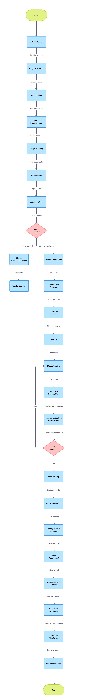
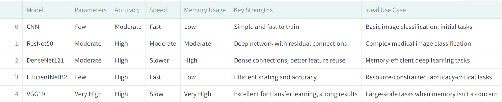

# 🦷 Oral Cancer Detection


## Overview

The **Oral Cancer Detection** project aims to develop a robust machine learning model that leverages advanced image processing techniques to accurately identify signs of oral cancer in images. This project integrates various technologies and frameworks, providing a seamless user experience for both medical professionals and patients.

## Key Features

- **📈 Accurate Detection:** Utilizes state-of-the-art deep learning algorithms for precise identification of oral cancer.
- **🖼️ Image Processing:** Implements OpenCV for enhanced image preprocessing, ensuring high-quality input for the model.
- **📊 User-Friendly Interface:** Built with Streamlit to offer an intuitive interface for users to upload images and view results.
- **🚀 Fast Performance:** Optimized for quick processing and real-time feedback.
- **📊 Data Visualization:** Includes interactive visualizations using Matplotlib and Graphviz for better understanding of model predictions.
- **🔄 Model Training and Evaluation:** Supports training with various datasets and evaluating model performance with scikit-learn.
- **☁️ Cloud Deployment:** Enables deployment using Kubernetes for scalability and reliability.

## Table of Contents

1. [Introduction](#introduction)
2. [Problem Statement](#problem-statement)
3. [Solution](#solution)
4. [Dataset](#dataset)
5. [Methodologies](#methodologies)
6. [Models Used](#models-used)
7. [Model Comparisons](#model-comparisons)
8. [Building Interface](#building-interface)
9. [Deployment](#deployment)
10. [Results](#results)
11. [Conclusion](#conclusion)
12. [Technolgies Used](#technolgies-used)
13. [Installation](#installation)
14. [Future Works](#future-works)
15. [References](#references)

## Introduction

The **Oral Cancer Detection** project aims to harness the power of machine learning and image processing to accurately detect oral cancer at an early stage. 🦷 Oral cancer is a significant health concern, often leading to severe consequences if not identified promptly. This project seeks to provide a reliable tool that aids medical professionals in diagnosing oral cancer through advanced techniques. 🩺

Utilizing a comprehensive dataset of oral images, this project implements various algorithms to train models capable of distinguishing between healthy and cancerous tissues. 📊 The application features a user-friendly interface, enabling healthcare practitioners to upload images and receive instant feedback on potential cancer detection. With the integration of visualization tools, users can gain insights into the model's predictions and the underlying data. 🔍

By leveraging state-of-the-art technologies, this project not only aims to improve diagnostic accuracy but also to facilitate early intervention, ultimately contributing to better patient outcomes. 🌈

## Problem Statement

Oral cancer is a major global health issue, accounting for hundreds of thousands of cases annually. Despite medical advancements, early detection of oral cancer remains a challenge, often leading to late-stage diagnoses and poor patient outcomes. 🦷 The lack of accessible and reliable diagnostic tools, particularly in remote and underserved areas, exacerbates this problem.

The need for a solution that allows medical professionals to identify oral cancer at an early stage is critical. 📉 Early detection can significantly improve survival rates and reduce treatment costs. Therefore, this project focuses on building a machine learning-based tool that assists in the early detection of oral cancer through image analysis, addressing both accessibility and diagnostic accuracy. 📲

## Solution

The **Oral Cancer Detection** project provides a machine learning-based solution to assist healthcare professionals in detecting oral cancer early. 🦷 By utilizing advanced deep learning techniques, this project processes and analyzes medical images to identify potential cancerous regions in the oral cavity.

This solution includes the following key components:

- **📸 Image Processing:** Uses OpenCV to preprocess images, enhancing the clarity and quality of input data for more accurate detection.
- **🤖 Machine Learning Models:** Employs cutting-edge deep learning models built using TensorFlow to classify images into cancerous and non-cancerous categories.
- **🖥️ User-Friendly Interface:** Features an easy-to-use Streamlit-based interface, enabling users to upload images and receive instant diagnostic results with high accuracy.
- **📊 Data Visualization:** Visualizes the prediction results and the areas of interest within the image, making it easier for healthcare professionals to interpret the results.
- **☁️ Cloud-Ready Deployment:** The model is scalable and can be deployed using Kubernetes for real-time and widespread use in clinical settings.

This approach not only makes cancer detection faster and more accessible but also enhances diagnostic precision, leading to better patient outcomes and earlier interventions. 🌟

## Dataset

### About the Dataset

Introducing the **Oral Cancer Image Dataset**! This dataset comprises 500 oral cancer images and 450 non-cancer oral images, all meticulously labeled for seamless classification. 🦷 The dataset is designed to support research and development in the field of oral cancer detection using advanced machine learning algorithms.

With a balanced representation of cancer and non-cancer samples, it allows researchers to explore innovative approaches to enhance diagnostic accuracy. 🔬 This dataset serves as a valuable resource for the healthcare community, fostering advancements in early detection and intervention for oral cancer. 💡

You can access the dataset [here](https://www.kaggle.com/datasets/zaidpy/oral-cancer-dataset) 📂.

## Methodologies

<details>
  <summary>📊 Click to view the Flowchart</summary>
  
  
  
</details>

### Process Overview

1. **📥 Data Collection:**
   Medical images are sourced from reliable and reputable datasets, ensuring a comprehensive mix of oral cancer and non-cancer samples. This provides a strong foundation for training the model, ensuring that it learns from high-quality, representative data.

2. **🛠️ Preprocessing:**
   To ensure consistency, all images are resized to a standard dimension of 260x260 pixels with 3 color channels (RGB). The images are normalized to a range between [0,1] for smoother training. Image augmentation techniques, such as rotation and flipping, are applied to make the model robust against variations and prevent overfitting.

3. **🧠 Model Selection:**
   A range of cutting-edge deep learning architectures are chosen for comparison:

   - **CNN (Convolutional Neural Networks):** A standard deep learning model for image classification.
   - **ResNet50:** A deeper network that addresses the vanishing gradient problem using skip connections.
   - **DenseNet121:** A model that efficiently passes gradients between layers using dense connections.
   - **EfficientNetB2:** A state-of-the-art model that balances accuracy and efficiency through compound scaling.
   - **VGG19:** A popular deep learning model with a simple, uniform architecture known for its performance in image tasks.

4. **🎓 Training:**
   Each model is trained using the preprocessed images. During training, the models adjust their weights using a process called **backpropagation** to minimize the loss function. The training continues for several epochs until the models converge, or achieve optimal performance on the training data.

5. **📊 Evaluation:**
   After training, the models are evaluated based on:

   - **Accuracy:** The proportion of correctly predicted labels.
   - **Speed:** How quickly the model processes new data.
   - **Memory usage:** The amount of system resources required by the model.
     Performance metrics such as **precision**, **recall**, and **F1 score** are calculated to assess how well the models balance true positives and false negatives.

6. **📈 Comparison:**
   Once all models are trained and evaluated, their performances are compared. The model that strikes the best balance between accuracy, speed, and resource efficiency is selected for deployment. This ensures that the deployed model is optimal for real-world use.

## Models Used

The following deep learning models were utilized in this project to compare their performance and select the best model for oral cancer detection:

### 1. **Convolutional Neural Network (CNN)**

A **Convolutional Neural Network (CNN)** is the foundation for most image classification tasks. CNNs are composed of convolutional layers that automatically learn spatial hierarchies of features (such as edges, textures, and objects). In this project:

- **Advantages**: CNNs are relatively easy to train and excel in capturing local features in images.
- **Use Case**: It serves as a baseline model, offering a simpler but powerful approach for detecting cancerous tissues in oral images.
- **Limitations**: While CNNs work well on simpler problems, they may struggle with more complex patterns found in medical data.

### 2. **ResNet50**

**ResNet50 (Residual Networks)** is a deeper network with 50 layers that incorporates **residual connections** (or skip connections) to solve the vanishing gradient problem common in deep networks. This makes it highly effective for complex tasks like medical image classification.

- **Advantages**: The residual connections enable the network to learn much deeper representations without degrading performance.
- **Use Case**: ResNet50 excels in detecting intricate patterns in medical images, making it a great candidate for identifying cancerous tissues.
- **Limitations**: As the network becomes deeper, it requires more computation power, increasing the time required for training.

### 3. **DenseNet121**

**DenseNet121 (Densely Connected Convolutional Networks)** employs dense blocks, where each layer is directly connected to every other layer, allowing feature reuse and improving efficiency.

- **Advantages**: DenseNet121 captures detailed information by reusing features, which can help the model efficiently learn the critical features needed for cancer detection.
- **Use Case**: Its ability to learn complex features makes it well-suited for cancer detection, as it captures small yet significant features in oral images.
- **Limitations**: DenseNet can be computationally demanding, especially when dealing with large datasets.

### 4. **EfficientNetB2**

**EfficientNetB2** is part of the EfficientNet family, which scales model dimensions—width, depth, and resolution—in a balanced manner, optimizing performance while using fewer parameters.

- **Advantages**: EfficientNetB2 provides high accuracy with fewer parameters, which is beneficial for resource-constrained environments (e.g., mobile applications or cloud-based deployments).
- **Use Case**: Its efficiency and accuracy make it an ideal choice for real-time cancer detection tasks where computational resources may be limited.
- **Limitations**: While it uses fewer parameters, EfficientNetB2 may still require considerable tuning and experimentation to optimize performance on highly complex tasks.

### 5. **VGG19**

**VGG19** is a very deep network with 19 layers, known for its simplicity and high performance in transfer learning tasks. It’s frequently used in medical imaging tasks due to its ability to generalize well from pretrained weights.

- **Advantages**: VGG19 is straightforward in architecture and powerful when fine-tuned on specific tasks, such as detecting cancer in oral images.
- **Use Case**: It’s often used for transfer learning, leveraging pretrained weights to adapt quickly to the specific task of oral cancer detection.
- **Limitations**: VGG19 is resource-intensive and slower compared to other models, which can make training and inference more time-consuming.

## Model Comparisons

Below is a visual representation of the differences in performance across the models used:



## Building Interface

### Building the User Interface with Streamlit

For this project, we utilized **Streamlit** to create an intuitive and user-friendly web interface for our oral cancer detection application. Streamlit is an open-source app framework specifically designed for machine learning and data science projects, allowing developers to quickly build and deploy interactive applications.

### Why Streamlit?

- **Simplicity:** Streamlit’s straightforward API enables rapid development without the need for complex web frameworks.
- **Interactivity:** It allows dynamic user input, such as uploading images, which the model can then analyze in real-time.
- **Integration:** Streamlit seamlessly integrates with popular Python libraries, making it ideal for deploying machine learning models and visualizing results.
- **Deployment:** With built-in support for deploying applications, Streamlit simplifies sharing our project with stakeholders and users, enhancing accessibility.

By leveraging Streamlit, we were able to focus on the model development and analysis while providing a polished, interactive interface for users to engage with the oral cancer detection system.

## Deployment

### 1. Deployment on Streamlit Cloud

The project has been deployed on **Streamlit Cloud** to make the oral cancer detection application accessible to users. The deployment process involved the following steps:

- **Pushed the Project to GitHub**: The complete codebase was uploaded to a GitHub repository, allowing version control and collaboration.
- **Deployed on Streamlit Cloud**: Using the GitHub repository, the project was deployed directly to Streamlit Cloud. This allows users to run the application in their web browser without any local setup.

Streamlit Cloud provides a seamless way to host applications, ensuring that users can easily interact with the model and visualize results.

### 2. Deployment Using Docker

In addition to Streamlit Cloud, we also utilized **Docker** for deployment. The Docker deployment process involved:

- **Creating a Dockerfile**: We created a Dockerfile that contains the instructions for building the Docker image, including the application's dependencies and configurations. Here is a sample Dockerfile:

```dockerfile
     # Use the official Python image from the Docker Hub
FROM python:3.8-slim

# Set the working directory
WORKDIR /app

# Copy the requirements.txt file into the container
COPY requirements.txt .

# Install the required Python packages
RUN pip install --no-cache-dir -r requirements.txt

# Copy the rest of the application code into the container
COPY . .

# Specify the command to run the Streamlit app
CMD ["streamlit", "run", "your_app.py", "--server.port=8501", "--server.address=0.0.0.0"]
```

### Building Docker Images and Pushing to Docker Hub

To build the Docker image and push it to Docker Hub, follow these steps:

1. **Build the Docker Image**: Run the following command in your terminal, ensuring you are in the directory containing your `Dockerfile`:

```bash
docker build -t jagadesh086/my_streamlit_app:latest .
```

2. ### Pushing to Docker Hub

After creating the Docker image for the application, we pushed it to **Docker Hub** to enable easy access and deployment from anywhere. The steps to push the image are as follows:

1. **Login to Docker Hub**:
   ```bash
   docker login
   ```
2. **Push the Image**:
   ```bash
   docker push jagadesh086/my_streamlit_app:latest
   ```

### 3. Deployment Using Kubernetes

For deploying the application in a more scalable environment, we utilized **Kubernetes**. We created two files, `deployment.yaml` and `service.yaml`, which defined how our Docker images should be deployed and accessed.

#### Deployment Configuration

Here’s the configuration for `deployment.yaml`:

```yaml
apiVersion: apps/v1
kind: Deployment
metadata:
  name: streamlit-app
  labels:
    app: streamlit
spec:
  replicas: 1
  selector:
    matchLabels:
      app: streamlit
  template:
    metadata:
      labels:
        app: streamlit
    spec:
      containers:
        - name: streamlit-app
          image: jagadesh086/my_streamlit_app:latest
          ports:
            - containerPort: 8501
```

### Service Configuration

In order to expose our Streamlit application to the outside world, we defined a Kubernetes **Service**. This allows users to access the application via a specific port on the cluster.

Here’s the configuration for `service.yaml`:

```yaml
apiVersion: v1
kind: Service
metadata:
  name: streamlit-service
spec:
  type: NodePort
  selector:
    app: streamlit
  ports:
    - protocol: TCP
      port: 8501
      targetPort: 8501
      nodePort: 30000 # You can choose any available port from 30000 to 32767
```
